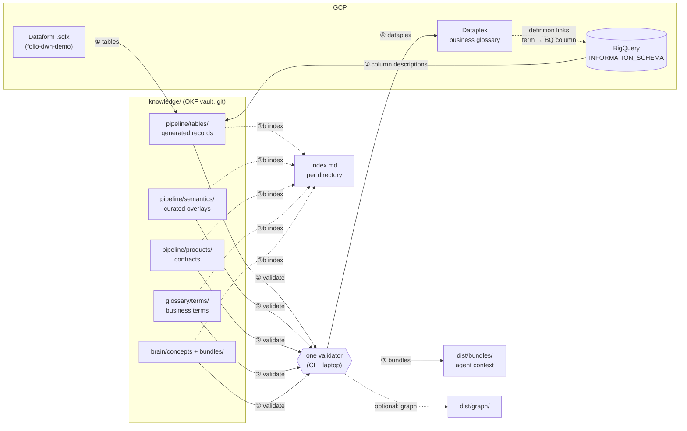

# OKF knowledge pipeline: a showcase

How to get from SQL models to a business glossary that people, BI tools and AI agents all read the same way, with every definition kept as a Markdown file in git.

This repository is a small, runnable version of a production setup. The domain is fictional: **Folio**, an online bookshop with four Dataform models, eight glossary terms and two agent bundles. Every step of the flow runs locally in under a second, without a GCP account.

> **Agents:** read [AGENTS.md](AGENTS.md) first.

---

## The problem

In most data teams, "revenue" is defined in four places: in the SQL, in a BI calculated field, in a wiki page and now also in an AI agent's prompt. The four drift apart, and nobody can say which one is right. An AI agent makes it worse: it sounds confident, and it will happily average a ratio.

The approach here: **every fact has one owner, written as a plain Markdown file with YAML frontmatter in one git repository. Everything else (the Dataplex glossary, the table catalog, the agent prompts) is compiled from those files and never edited by hand.**

## The flow



| Step | Command | In | Out | Why |
| :-- | :-- | :-- | :-- | :-- |
| ① **Tables** | `okf-showcase tables` | Dataform `.sqlx`, BigQuery column descriptions | `knowledge/pipeline/tables/<layer>/<table>.md`: full BigQuery address, GCP project, columns, `upstream` / `downstream` | The physical layer is documented by a machine, so it is never out of date. Column descriptions are taken from BigQuery where they exist. |
| ①b **Index** | `okf-showcase index` | the vault directories | one `index.md` per directory (OKF §6) | Progressive disclosure: a person or an agent sees what a folder holds, with one-line descriptions, before opening any file. |
| ② **Validate** | `okf-showcase validate` | the whole vault | pass or a list of errors | Frontmatter per type, every wikilink resolves, every term column exists in a table, every ratio says how to aggregate it, every table sits in a known GCP project. |
| ③ **Bundles** | `okf-showcase bundles` | bundle specs in `brain/bundles/` | `dist/bundles/*.md` | One self-contained context file per agent, compiled from terms, tables and overlays, within a token budget. |
| ④ **Dataplex** | `okf-showcase dataplex` | glossary terms | `dist/dataplex/plan.json` | The glossary as Dataplex requests in two passes: terms first, then links from BigQuery columns to terms. Dry run only. |
| optional | `okf-showcase graph` | the whole vault | `dist/graph/graph.json` | Nodes and edges for a property graph (lineage and meaning in one query). |

`okf-showcase build` runs all of them. A walkthrough with real output is in [docs/01-the-flow.md](docs/01-the-flow.md).

### Who does what

| Role | Edits | Never edits |
| :-- | :-- | :-- |
| Analytics engineer | `.sqlx` models, semantics overlays | generated table records |
| Data steward | glossary terms | Dataplex directly (it is a compiled view) |
| Product owner | data product contracts | |
| Architect / lead | brain concepts, bundle specs | compiled bundles in `dist/` |
| CI | generated records, `index.md` files, `dist/`, the Dataplex glossary | anything a person owns |

## Quick start

```bash
uv sync
uv run okf-showcase build          # ① to ④ and the graph
uv run okf-showcase tables --check # CI guard: committed records equal a fresh generation
uv run okf-showcase index --check  # same for the generated index.md files
uv run pytest
```

Start reading at [knowledge/index.md](knowledge/index.md), or open `knowledge/` as an [Obsidian](https://obsidian.md) vault to see the files and their links as a graph, and read `dist/bundles/da-sales-analytics.md` to see what an analytics agent gets.

## Repository map

```
okf.yaml                  settings: vault path, GCP project map, Dataplex target
AGENTS.md                 instructions for AI agents working in this repo
example/
  dataform/               a tiny Dataform repository (the SQL side, 4 layers, 3 GCP projects)
  bigquery/               snapshot of BigQuery column descriptions (INFORMATION_SCHEMA)
knowledge/                the OKF vault: one Markdown file per fact
  index.md                GENERATED entry point (every directory has one)
  glossary/terms/         business terms: meaning, formula, additivity, synonyms, column binding
  pipeline/tables/        GENERATED table records (never edit)
  pipeline/semantics/     curated meaning of a table: grain, column kinds, golden queries
  pipeline/products/      data product contracts: public tables and published metrics
  brain/concepts/         cross-cutting rules and architecture
  brain/bundles/          specs of agent context bundles
src/okf_showcase/         the tools, one module per step
templates/                starting points for each document type
docs/                     why it is built this way
dist/                     build output (not committed)
```

## Read next

1. [The flow, step by step](docs/01-the-flow.md): commands, outputs, what each step checks.
2. [OKF and the file structure](docs/02-okf-and-file-structure.md): what a document looks like, per type.
3. [Layers and ownership](docs/03-layers-and-ownership.md): glossary, pipeline, brain, and the one-owner rule.
4. [Back to GCP](docs/04-back-to-gcp.md): projects, Dataform, BigQuery descriptions, Dataplex links.
5. [Bundles for agents](docs/05-bundles.md): how context for an AI agent is compiled.
6. [CI and governance](docs/06-ci-and-governance.md): what blocks a pull request and why.
7. [Optional: property graph](docs/07-property-graph.md).
8. [Decisions](docs/decisions/): short records of the choices behind the design.

## What is simplified here

| Here | In production |
| :-- | :-- |
| `.sqlx` config is parsed from text | `dataform compile --json` resolves includes, JavaScript and defaults |
| BigQuery descriptions from a JSON snapshot | a query on `INFORMATION_SCHEMA.COLUMN_FIELD_PATHS` per project |
| Dataplex plan written to a file | API calls with a diff against the live glossary, pruning of removed terms, rate-limited link writes |
| Bundles as Markdown | also per-product agent context with allowlisted tables and golden queries, plus evaluation sets |
| One CI workflow | scheduled syncs that open a pull request when Dataform changes, and a reverse sync from edits made in the Dataplex UI |

The structure, the rules and the file formats are the same.

## Built on

[Open Knowledge Format (OKF) v0.1](docs/02-okf-and-file-structure.md#okf-in-one-paragraph): knowledge as a directory of Markdown files with YAML frontmatter. This repository adds document types for a data team, a validator and compilers for Google Cloud.

## License

[MIT](LICENSE). All names, projects and data are fictional.
