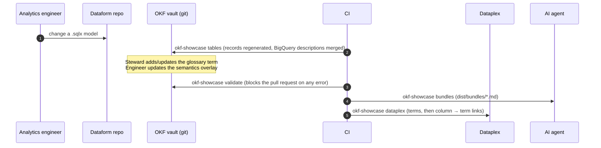

# 1. The flow, step by step

From a `.sqlx` file to a glossary term in Dataplex and a context file for an AI agent. Each step is one command and one module in `src/okf_showcase/`.



## ① Tables: Dataform → generated records

```bash
uv run okf-showcase tables
# tables: 5 records written
```

Input: every `.sqlx` file under `example/dataform/definitions/`. The first folder is the layer (`0_sources`, `1_staging`, `2_analytics`, `3_reporting`).

Output, for example `knowledge/pipeline/tables/3_reporting/r_sales_monthly.md`:

```yaml
resource: bigquery:folio-analytics-demo.reporting.r_sales_monthly
gcp_project: folio-analytics-demo     # from `database:` or Dataform's defaultProject
layer: 3_reporting
materialization: table
partition_by: order_month
upstream:
- '[[stg_orders]]'                    # from ${ref("stg_orders")}
columns:
  net_revenue_eur:
    description: 'Net revenue in EUR: paid orders at ...'
    description_source: bigquery      # BigQuery had a description, so it wins
  orders:
    description: Number of paid or refunded orders.
    description_source: dataform      # BigQuery had none, Dataform's is used
```

Why generate instead of writing by hand: there are hundreds of tables in a real warehouse and they change daily. A generated record is always correct; a hand-written one is correct on the day it was written. The record also fixes the identity of every table (its slug) so the rest of the vault can link to it.

Why `downstream` too: it is the impact list for a change. An engineer or an agent changing `stg_orders` sees immediately that `customer_monthly_activity` and `r_sales_monthly` depend on it.

## ①b Index: OKF index files

```bash
uv run okf-showcase index
# index: 16 index.md files written
```

OKF v0.1 (section 6) defines `index.md` as the directory listing of a bundle: no frontmatter, sections with `* [Title](file.md) - description` entries. The generator writes one per vault directory, takes each entry's description from the document's frontmatter and each directory's description from `index_descriptions` in `okf.yaml`. The root index declares `okf_version: "0.1"`, the only frontmatter the spec allows in an index.

Why: progressive disclosure. An agent reading `knowledge/index.md` sees three layers in three lines, then descends only into the folder it needs, instead of loading 50 files to find one. Humans get the same view when browsing the repository on GitHub.

Indexes are committed (GitHub and Obsidian show them) and `index --check` fails in CI when one is stale.

## ② Validate: one validator for everything

```bash
uv run okf-showcase validate
# validate: vault is valid
```

What it checks is listed at the top of [validate.py](../src/okf_showcase/validate.py). The checks that matter most:

| Check | Catches |
| :-- | :-- |
| Every wikilink resolves | a term related to a deleted term, a bundle including a renamed table |
| A term's `resource` column exists in the table record | a glossary that points at a column that was renamed in Dataform |
| A table's `gcp_project` is in `okf.yaml` | a model writing to a project nobody declared |
| Ratio and distinct-count columns have `how_to_count` | an agent meeting a non-additive column without instructions |
| Term description ≤ 300 characters, labels match `^[a-z0-9_-]{1,63}$` | a Dataplex deploy that would fail after merge |

The same command runs in CI and on a laptop. A rule that only an LLM can check is not a rule.

## ③ Bundles: context for agents

```bash
uv run okf-showcase bundles
# bundles: 2 compiled to dist/bundles
```

A bundle spec (`knowledge/brain/bundles/da-sales-analytics.md`) has directives in its body and wikilinks in `include`. The compiler resolves each link and renders it:
- a **term** with its aliases, column, `data_agent_hints` and body;
- a **table** as BigQuery address + grain + columns with kind and `how_to_count` + constraints + golden queries, merged from the generated record and its overlay;
- a **concept** or **product** with its body.

The output is one Markdown file per agent. If it exceeds `max_token_budget`, the build fails. Details: [05-bundles.md](05-bundles.md).

## ④ Dataplex: the glossary in the catalog

```bash
uv run okf-showcase dataplex
# dataplex: 10 categories and terms, 14 links -> dist/dataplex/plan.json (dry run, nothing sent)
```

Pass 1 creates or updates glossary categories and terms. Pass 2 creates entry links:
- `definition`: BigQuery column `r_sales_monthly.net_revenue_eur` → term `net-revenue`. In the Dataplex UI and in BigQuery Studio, the column now shows its business definition.
- `related`: term ↔ term, from `related_terms`.

Two passes because a link needs both ends to exist. Details: [04-back-to-gcp.md](04-back-to-gcp.md).

## Optional: graph

```bash
uv run okf-showcase graph
```

The same vault as nodes and edges. See [07-property-graph.md](07-property-graph.md).

## A change, end to end

"Finance wants net revenue to exclude shipping."

1. Engineer changes `stg_orders.sqlx`, runs `okf-showcase tables`: records regenerate.
2. Steward updates `glossary/terms/metrics/net-revenue.md` (definition, body section 1).
3. `okf-showcase validate` passes; the pull request shows the SQL diff, the record diff and the definition diff side by side.
4. After merge, CI rebuilds the bundles and deploys the glossary: the agent, the Dataplex catalog and BigQuery Studio show the new definition on the same day, from the same file.
