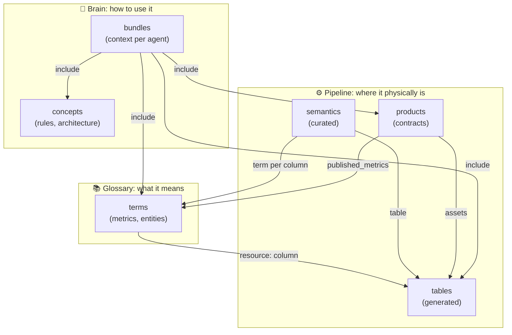

# 3. Layers and ownership

## Three layers

| Layer | Answers | Changes when | Edited by |
| :-- | :-- | :-- | :-- |
| Glossary | What does "net revenue" mean? Can I sum it? What else is it called? | the business changes a definition | data stewards |
| Pipeline | Which table and column? What project? What does it depend on? What is one row? | the SQL changes | generator + analytics engineers |
| Brain | Which rules apply everywhere? What does each agent need? | the way of working changes | architects, leads |

## One owner per fact

The rule that holds the design together. Every fact is edited in exactly one place; every other appearance is compiled.

| Fact | Owner (edited here) | Compiled into |
| :-- | :-- | :-- |
| Metric meaning, formula, additivity, synonyms | glossary term | Dataplex, bundles |
| Table, columns, partitioning, lineage | Dataform `.sqlx` | table record, graph |
| Column description | BigQuery (Dataform where BigQuery has none) | table record, Dataplex |
| Grain, column kinds, golden queries | semantics overlay | bundles |
| Tables an agent may use | data product contract | bundles |
| Rules for agents | concept, bundle body | bundles |

Why it matters: a wrong answer can be traced to exactly one file, and fixing that file fixes every place that shows it. Without the rule, the same definition lives in SQL comments, the BI tool, a wiki and a prompt, and they drift.

How it is enforced:
- generated files carry a "do not edit" note and CI rejects any committed generated file that differs from a fresh generation (`tables --check`);
- the validator checks the bindings between owners (term → column, overlay → table, product → tables and terms);
- bundles reference documents by link and never copy their content.

## Data products: a contract, not a folder

A data product (`pipeline/products/dp-*.md`) says which tables are its public surface (`assets`), which terms it promises (`published_metrics`) and what it is for (`north_star`). This is what scopes an analytics agent: it is offered the product's tables, not the whole warehouse. The other tables stay in the vault for lineage, impact analysis and engineering agents.

Why a contract: a warehouse has hundreds of tables, many of them intermediate or deprecated. An agent that may choose any of them will sometimes choose wrong. A product says "these, and only these, are meant to be read".
