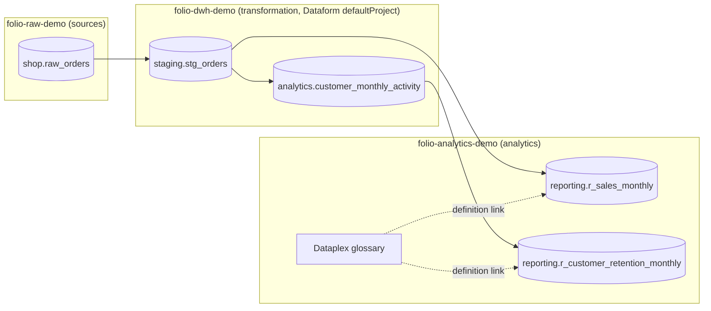

# 4. Back to GCP: projects, Dataform, BigQuery, Dataplex

The vault is not a copy of GCP; it points into it. This page shows every place where a file names a GCP resource and how that link is kept correct.



## 1. The project map

`okf.yaml` declares every GCP project the vault may refer to and its role:

```yaml
gcp_projects:
  folio-raw-demo:        { role: sources }         # declared in Dataform, never written
  folio-dwh-demo:        { role: transformation }  # Dataform defaultProject
  folio-analytics-demo:  { role: analytics }       # reporting marts, glossary, agents
```

Why split projects by role: costs, permissions and blast radius. The transformation project can be rebuilt freely; the analytics project is what dashboards and agents read and what the glossary describes, so access there is narrower and changes are slower.

The validator rejects a table whose project is not in the map. A new project is a conscious decision, not a typo in a `database:` field.

## 2. Dataform → project of each table

Each generated record gets the full address:

| `.sqlx` config | Project used | Record |
| :-- | :-- | :-- |
| `database: "folio-raw-demo"` | `folio-raw-demo` | `resource: bigquery:folio-raw-demo.shop.raw_orders` |
| no `database:` | `defaultProject` from `workflow_settings.yaml` | `resource: bigquery:folio-dwh-demo.staging.stg_orders` |
| `database: "folio-analytics-demo"` | `folio-analytics-demo` | `resource: bigquery:folio-analytics-demo.reporting.r_sales_monthly` |

In production, `dataform compile --json` gives the resolved `target.database`, `target.schema` and `target.name` of every action, so even models whose project is computed in JavaScript get the right address.

## 3. BigQuery → column descriptions

Column descriptions have two writers: the Dataform `columns {}` block, and BigQuery itself (descriptions set in the console, by a Dataplex description workflow, or by DDL). BigQuery is what users actually see, so it wins:

1. BigQuery description, if the table's project is in `bigquery_description_projects` and the column has one;
2. otherwise the Dataform description;
3. otherwise none.

Each column records the source (`description_source: bigquery | dataform`), so a reviewer can see where a text came from and which writer to fix.

The snapshot in `example/bigquery/information_schema.json` stands in for this query, run once per listed project:

```sql
SELECT
  CONCAT(table_catalog, '.', table_schema, '.', table_name) AS table_address,
  column_name,
  description
FROM `folio-analytics-demo`.`region-eu`.INFORMATION_SCHEMA.COLUMN_FIELD_PATHS
WHERE description IS NOT NULL
  AND field_path = column_name   -- top-level columns only
```

Why only some projects: reading `INFORMATION_SCHEMA` needs permissions per project, and the descriptions that matter are on the tables people read. A project outside the list keeps its Dataform descriptions, so a missing permission never silently wipes the records.

Production detail worth copying: Dataform `CREATE OR REPLACE` drops column descriptions that were set outside Dataform. Persist them before the replace and re-apply them after (a pre/post operation), otherwise every run erases the work of the description workflow.

## 4. Glossary → Dataplex → back to BigQuery columns

A term's `resource` (`project.dataset.table.column`) becomes a Dataplex **definition** entry link:

```json
{
  "entryLinkType": "projects/dataplex-types/locations/global/entryLinkTypes/definition",
  "entryReferences": [
    {"name": ".../entryGroups/@bigquery/entries/bigquery.googleapis.com/projects/folio-analytics-demo/datasets/reporting/tables/r_sales_monthly",
     "path": "Schema.net_revenue_eur", "type": "SOURCE"},
    {"name": ".../entryGroups/@dataplex/entries/.../glossaries/folio-business-glossary/terms/net-revenue",
     "type": "TARGET"}
  ]
}
```

The effect: in Dataplex and in BigQuery Studio, the column `net_revenue_eur` shows the business term "Net Revenue" with its definition. Search for "revenue" finds the column. Data agents grounded in the catalog see the same definition the bundle has.

Why two passes: a link needs both its source entry and its target term to exist, so all terms are written before any link. Why link IDs are a hash of both ends: a rerun produces the same ID, so a deploy is idempotent and a removed `resource` can be detected and its link pruned.

What a production deployer adds on top of `plan.json`:
- reads the live glossary and sends only creates, updates and deletes (diff, not overwrite);
- rate-limits and retries link writes (the API has per-minute quotas);
- runs keyless from CI through Workload Identity Federation;
- a reverse sync turns edits made in the Dataplex UI into a pull request against the vault, so the files stay the owner.

## Summary of links into GCP

| In the vault | Points to | Kept correct by |
| :-- | :-- | :-- |
| `okf.yaml` `gcp_projects` | GCP projects | validator: every table project must be listed |
| table record `resource`, `gcp_project` | BigQuery table | generator from Dataform; `tables --check` in CI |
| table record `columns[].description` | BigQuery column description | generator reading INFORMATION_SCHEMA |
| term `resource` | BigQuery column | validator: column must exist in the table record |
| Dataplex plan | Dataplex glossary and entry links | built from terms on every merge |
